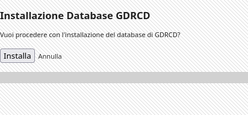
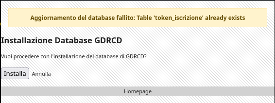

# Database: Migrazioni

Le database migrations sono uno strumento fondamentale per la gestione evolutiva e la manutenzione del database in progetti mantenuti da più sviluppatori e con release incrementali. GDRCD adotta un sistema di schema migration ispirato alle best practice dei principali framework professionali ([Schema Migration](https://en.wikipedia.org/wiki/Schema_migration)).

## Come applicare le migrations

Per applicare le migrations, è sufficiente navigare all'endpoint `/installer.php` dell'applicazione e cliccare sul pulsante "Installa". GDRCD eseguirà tutte le migrations non ancora applicate e mostrerà un messaggio di successo oppure di errore in caso di fallimento dell'operazione.

**Pagina Di Installazione**



**Migration Riuscita**


**Migration Fallita**




## Funzionamento delle Migrations

Le migrations sono script che descrivono in modo incrementale le modifiche strutturali al database (creazione, modifica, eliminazione di tabelle, colonne, indici). Ogni migration rappresenta una singola operazione o gruppo di operazioni correlate e viene salvata come file separato, seguendo una convenzione di naming cronologica e descrittiva.

Il sistema di migrations esegue automaticamente i file in ordine temporale, applicando le modifiche necessarie per portare lo schema del database alla versione desiderata. Questo consente di:
- Versionare lo schema del database
- Applicare e condividere facilmente le evoluzioni tra ambienti di sviluppo, test e produzione
- Eseguire rollback in caso di errori

Le migrations permettono di mantenere allineati tutti gli ambienti e di tracciare con precisione ogni modifica strutturale, semplificando la collaborazione tra sviluppatori.

## Workflow Tecnico

Ogni modifica strutturale (creazione, aggiornamento, eliminazione di tabelle, colonne, indici) deve essere implementata tramite una migration dedicata, secondo le convenzioni descritte di seguito. Le migrations sono eseguite in ordine cronologico e permettono di mantenere allineati gli ambienti di sviluppo, test e produzione.

### Tracciamento delle migrations

Quando si applica una migration, GDRCD registra l'operazione nella tabella `_gdrcd_db_versions`. Per ogni migration applicata viene inserito un record con:
- `migration_id`: la parte numerica iniziale del nome del file della migration (ad esempio, `202508310218`).
- `applied_on`: la data e ora di applicazione della migration

L'id di ogni migration **deve essere univoco** per evitare conflitti e sovrapposizioni tra diverse modifiche.

Questa tabella consente di tenere traccia di tutte le migrations già eseguite, evitando duplicazioni e garantendo il corretto ordine di applicazione tra diversi ambienti.

### Come scrivere una migration

Le migrations vanno scritte nella cartella `db_versions` del progetto. Ogni migration è una classe PHP che estende `DbMigration` e implementa due metodi principali:
- `up()`: applica le modifiche desiderate al database (ad esempio, crea una tabella o aggiunge una colonna)
- `down()`: annulla le modifiche apportate da `up()` (ad esempio, elimina la tabella o la colonna creata)

Esempio di migration per la creazione di una tabella:

```php
<?php
class GDRCD57_Create_Token_Iscrizione_Table extends DbMigration
{
	public function up() {
		// Creazione tabella token_iscrizione
		gdrcd_query("CREATE TABLE `token_iscrizione` (
			`id` INT(10) NOT NULL AUTO_INCREMENT,
			`valore` VARCHAR(50) NULL DEFAULT NULL,
			`creato_il` DATE NULL DEFAULT NULL,
			`scadenza` DATE NULL DEFAULT NULL,
			`utilizzato` INT(10) NULL DEFAULT NULL,
			`utilizzato_da` VARCHAR(50) NULL DEFAULT NULL,
			`data_utilizzo` DATE NULL DEFAULT NULL,
			PRIMARY KEY (`id`) USING BTREE,
			UNIQUE INDEX `valore` (`valore`) USING BTREE
		) ENGINE=InnoDB DEFAULT CHARSET = utf8mb4 COLLATE = utf8mb4_general_ci");
	}

	public function down() {
		// Rimozione tabelle create in up()
		gdrcd_query("DROP TABLE IF EXISTS `token_iscrizione`");
	}
}
```

Questa struttura consente di gestire in modo sicuro sia l'applicazione che l'annullamento delle modifiche, facilitando il versionamento e il rollback dello schema del database.

### Convenzione sui Nomi delle Migrazioni

I nomi dei file delle migrazioni devono includere una descrizione dell'operazione, seguendo il template:

`[yyyy][mm][dd][hh][mm]_GDRCD[version]_[description].php`

**Esempio:**

`202508310218_GDRCD57_Create_Personaggio_Table.php`

La descrizione deve seguire il case dell'esempio e, quando possibile, uno dei seguenti template per uniformità:

- `[Create/Drop]_[nometabella]_Table`
	*Quando si crea o elimina una tabella*
- `[Add/Drop/Update]_[nomecolonna]_Column_In_[nometabella]_Table`
	*Quando si aggiunge, elimina o modifica una colonna*
- `[Add/Drop/Update]_[nomeindice]_Index_In_[nometabella]_Table`
	*Quando si aggiunge, elimina o modifica un indice*
- `[Insert/Delete/Update]_[nomedato]_In_[nometabella]_Table`
	*Quando si aggiunge, elimina o modifica uno o più records in una stessa tabella*

**Esempi:**

- `Create_Personaggio_Table`
- `Drop_Personaggio_Table`
- `Add_Id_Column_In_Personaggio_Table`
- `Drop_Email_Column_In_Utente_Table`
- `Update_Descrizione_Column_In_Gilda_Table`
- `Add_Nome_Index_In_Personaggio_Table`
- `Drop_DataIscrizione_Index_In_Utente_Table`
- `Update_Status_Index_In_Personaggio_Table`
- `Insert_ConfigurazioniForum_In_Configurazioni_Table`
- `Delete_ConfigurazioniPersonaggio_In_Configurazioni_Table`

**Nota Bene:**
Quando si scrive una migration per creare una tabella, non è necessario separare la creazione degli indici in una distinta migration. Le linee guida su colonne e indici si applicano quando è necessario aggiornarli in una migration successiva alla creazione della tabella.
