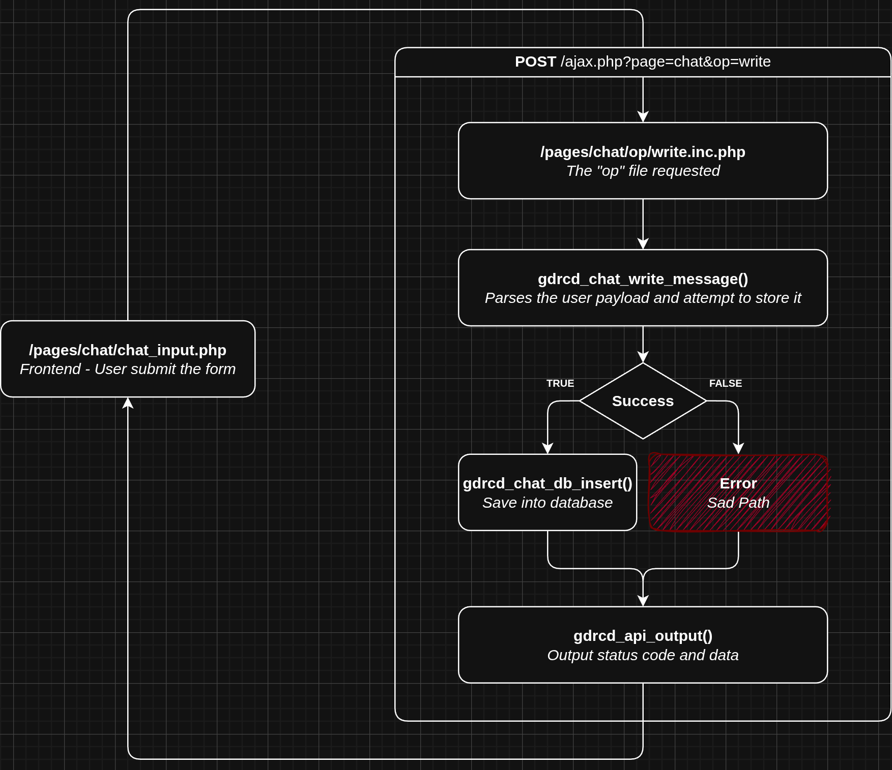

# GDRCD - Chat

Questa documentazione illustra i tre flussi principali che gestiscono la chat AJAX nel sistema GDRCD. Ogni flusso è accompagnato da una spiegazione del processo e delle funzioni PHP coinvolte, con snippet di codice a supporto.

---

## 1. Lettura Messaggi Chat (`chat_read`)


### Descrizione Sommaria

La lettura dei messaggi avviene tramite polling dal frontend (`chat_box.php`). Il browser invia una richiesta GET a `/pages/chat/ajax.php?op=chat_read`. Questa richiesta viene gestita dal file `chat_read.inc.php` che si occupa di recuperare i nuovi messaggi dal database, formattarli in HTML e restituirli al frontend.

### Funzioni PHP Coinvolte

**chat_read.inc.php**
Gestisce la logica di lettura, invocando le funzioni di seguito:

```php
$azioni = gdrcd_chat_read_messages($map_id, $chat_last_id);
gdrcd_chat_output($azioni);
```

**gdrcd_chat_read_messages()**
Recupera i messaggi dal database:

```php
function gdrcd_chat_read_messages($luogo, $last_id = 0) {
    ...
    while ($riga_azione = gdrcd_query($query_azioni, 'assoc')) {
        $azione = gdrcd_chat_message_handler($riga_azione);
        $azioni[] = [
            'id' => $riga_azione['id'],
            'mittente' => $riga_azione['mittente'],
            'azione' => $azione
        ];
    }
    ...
}
```

**gdrcd_chat_message_handler()**
Formatta ogni messaggio in HTML in base alla tipologia:

```php
function gdrcd_chat_message_handler($azione) {
    switch ($azione['tipo']) {
        case GDRCD_CHAT_MESSAGE_TYPE:
            return gdrcd_chat_message_format($azione);
        // ... altri tipi
        default:
            return null;
    }
}
```

**gdrcd_chat_output()**
Restituisce la risposta in formato JSON al frontend:

```php
function gdrcd_chat_output($status) {
    header('Content-type: application/json;charset=utf-8');
    http_response_code($code);
    echo json_encode(['code' => $code, 'message' => $message]);
}
```

#### **Formattazione HTML delle azioni**

La formattazione delle azioni in HTML è demandata alle funzioni con suffisso `_format` e `_component`.
Ogni tipo di messaggio (parlato, azione, sussurro, tiro di dado, ecc.) viene gestito da una specifica funzione di formattazione, chiamata dalla funzione principale `gdrcd_chat_message_handler()`.

**Esempio di flusso di formattazione: Messaggio di tipo "Azione"**

```php
function gdrcd_chat_message_handler($azione) {
    switch ($azione['tipo']) {
        case GDRCD_CHAT_ACTION_TYPE:
            return gdrcd_chat_action_format($azione);
        // ... altri tipi
        default:
            return null;
    }
}
```

**Funzione di formattazione:**

```php
function gdrcd_chat_action_format($azione) {
    // Componenti HTML del messaggio
    $chat_avatar = gdrcd_chat_avatar_component($azione);
    $chat_time = gdrcd_chat_time_component($azione);
    $chat_icons = gdrcd_chat_icons_component($azione);
    $chat_sender = gdrcd_chat_sender_component($azione);
    $chat_tag = gdrcd_chat_tag_component($azione);
    $chat_mittente_e_tag = gdrcd_chat_name_component($chat_sender . $chat_tag, false);
    $chat_body = gdrcd_chat_body_with_colors_component($azione);

    // Composizione finale del messaggio
    return gdrcd_chat_message_component(
        $azione['tipo'],
        <<<HTML
            {$chat_avatar}
            {$chat_time}
            {$chat_icons}
            {$chat_mittente_e_tag}
            {$chat_body}
        HTML
    );
}
```

**Componenti HTML**
Le funzioni con suffisso `_component` sono "mattoni" riutilizzabili che formattano singole parti del messaggio, come il nome, l'orario, l'avatar, il corpo del testo, ecc.

Esempio:
```php
function gdrcd_chat_time_component($azione) {
    $time = gdrcd_format_time($azione['ora']);
    return <<<HTML
        <span class="chat_time">{$time}</span>
    HTML;
}
```

**Composizione finale**
La funzione `gdrcd_chat_message_component()` incapsula tutto l'HTML in un contenitore identificato per tipologia:

```php
function gdrcd_chat_message_component($tipo, $azione_html) {
    return <<<HTML
        <div class="chat_row_{$tipo}">
            {$azione_html}
            <br style="clear:both;" />
        </div>
    HTML;
}
```

**Risultato finale (esempio)**

Supponendo di avere un'azione di tipo "A" (azione), il risultato sarà un HTML simile a:

```html
<div class="chat_row_A">
     <!-- avatar -->
    <span class="chat_time">23:03</span>
    <span class="chat_icons">...</span>
    <span class="chat_name">Blancks [TAG]</span>
    <span class="chat_msg">si avvicina al tavolo</span>
    <br style="clear:both;" />
</div>
```

Ogni tipo di messaggio utilizza una funzione `_format` dedicata, che a sua volta usa vari componenti per costruire il risultato HTML in modo modulare e riutilizzabile.

---

## 2. Scrittura Messaggi Chat (`chat_write`)



### Descrizione Sommaria

La scrittura dei messaggi avviene quando l'utente invia un testo in chat tramite il form (`chat_input.php`). Il payload viene inviato via POST a `/pages/chat/ajax.php?op=chat_write`, gestito da `chat_write.inc.php`. I dati vengono processati e salvati nel database se validi.

### Funzioni PHP Coinvolte

**chat_write.inc.php**
Riceve la richiesta e invoca la funzione di scrittura:

```php
$chat_insert_status = gdrcd_chat_write_message($message, $tag_o_destinatario, $type);
gdrcd_chat_output($chat_insert_status);
```

**gdrcd_chat_write_message()**
Determina la tipologia del messaggio e lo salva:

```php
function gdrcd_chat_write_message($message, $tag_o_destinatario = '', $type = null) {
    if (empty($type)) {
        $type = gdrcd_chat_get_type_from_message($message);
    }
    switch ($type) {
        case GDRCD_CHAT_MESSAGE_TYPE:
            return gdrcd_chat_message_save($tag_o_destinatario, $message);
        // ... altri tipi
        default:
            return gdrcd_chat_status_invalid(...);
    }
}
```

**gdrcd_chat_db_insert_for_login()**
Salva il messaggio nella tabella `chat` del database:

```php
function gdrcd_chat_db_insert_for_login($tag_o_destinatario, $tipo, $testo) {
    gdrcd_chat_db_insert(
        $_SESSION['luogo'],
        [$_SESSION['sesso'], $_SESSION['img_razza']],
        $_SESSION['login'],
        $tag_o_destinatario,
        $tipo,
        $testo
    );
}

function gdrcd_chat_db_insert(
    $stanza,
    $imgs,
    $mittente,
    $tag_o_destinatario,
    $tipo,
    $testo
) {
    gdrcd_stmt(
        'INSERT INTO chat (stanza, imgs, mittente, destinatario, ora, tipo, testo)
        VALUES (?, ?, ?, ?, NOW(), ?, ?)',
        [
            'isssss',
            $stanza,
            implode(';', $imgs),
            $mittente,
            $tag_o_destinatario,
            $tipo,
            $testo
        ]
    );
}
```

**gdrcd_chat_output()**
Restituisce la risposta (successo o errore) al frontend:

```php
function gdrcd_chat_output($status) {
    // Vedi esempio sopra
}
```

---

## 3. Sistema Abilità / Skill System (`chat_skillsystem`)


### Descrizione Sommaria

Il flusso del sistema abilità viene attivato quando l'utente invia il form dei tiri in chat. Il frontend invia una richiesta POST a `/pages/chat/ajax.php?op=chat_skillsystem`, che viene gestita da `chat_skillsystem.inc.php`. In base alla selezione dell'utente (`skills`, `stats`, `dice`, `items`), viene invocata la funzione PHP corretta per gestire la richiesta.

### Funzioni PHP Coinvolte

**chat_skillsystem.inc.php**
Gestisce la selezione dell'azione:

```php
switch ($selezione_tiro) {
    case 'skills':
        $output = gdrcd_chat_use_skill($id_ab);
        break;
    case 'stats':
        $output = gdrcd_chat_use_stats($id_stats);
        break;
    case 'dice':
        $output = gdrcd_chat_use_dice($dice, $dice_number, $dice_modifier, $dice_threshold);
        break;
    case 'items':
        $output = gdrcd_chat_use_item($id_item);
        break;
    default:
        $output = gdrcd_chat_status_invalid(...);
        break;
}
gdrcd_chat_output($output);
```

**Funzioni Azione Specifica**

- `gdrcd_chat_use_skill()` – Effettua un tiro su abilità.
- `gdrcd_chat_use_stats()` – Effettua un tiro su caratteristica.
- `gdrcd_chat_use_dice()` – Lancia i dadi.
- `gdrcd_chat_use_item()` – Usa un oggetto.

Queste funzioni invocano a loro volta `gdrcd_chat_write_message()` per gestire l'inserimento dell'azione.

---

## Note Generali

- Tutti i flussi si basano su AJAX e su risposte JSON standardizzate tramite `gdrcd_chat_output()`.
- Ogni flusso ha un "Sad Path" (gestione errori) che restituisce un messaggio di errore al frontend in caso di dati non validi o permessi insufficienti.
- La logica di formattazione dei messaggi è centralizzata in `functions.chat_read.inc.php`, mentre la logica di scrittura/insert in `functions.chat_write.inc.php`.

---

## Riferimenti Codice

- `chat_read.inc.php`
- `chat_skillsystem.inc.php`
- `chat_write.inc.php`
- `functions.chat_core.inc.php`
- `functions.chat_read.inc.php`
- `functions.chat_write.inc.php`
